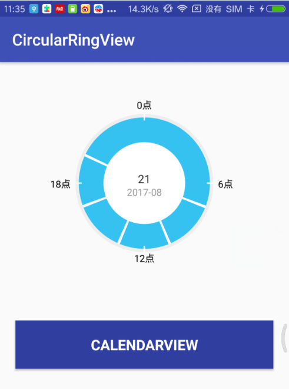
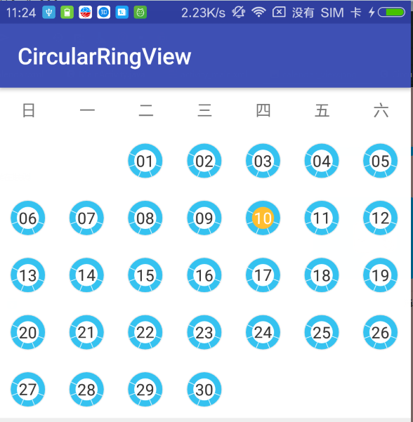

# CircularRingView
A simple ring control that shows the current date in part of the ring, but the reality is a 24-hour check-in record.

## Here is date pick effect by picture

#### Circular

 

#### Calendar

 

## Usage

### Step 1
Add below dependency in your build.gradle file.  
	
    dependencies {
        compile 'com.github.christian-zs:CircularRingView:v1.0'
    }

### Step 2
Use the CircularRingView in layout file, you can add customized attributes here.

    <com.example.zs.library.CircularRingView
        android:id="@+id/view"
        android:layout_width="300dp"
        android:layout_height="300dp"
        android:layout_gravity="center"
        app:centerTextSize="16sp"
        app:centerYearMonthTextSize="14sp"
        app:circleScaleTextSize="12sp"
        app:isShowScale="true" />
        